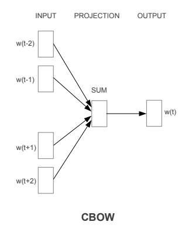
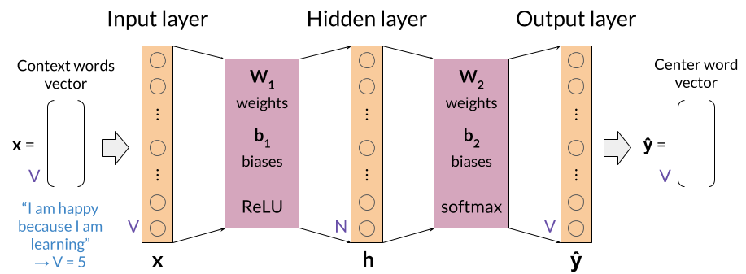

# Creating Word Embeddings Using The CBoW Model

## CBoW (Continuous Bag of Words Model)
The CBoW model architecture tries to predict the current target word (the center word) based on 
the source context words (surrounding words). Considering a simple sentence, 
_"the quick brown fox jumps over the lazy dog”_, this can be pairs of 
(context_window, target_word) where if we consider a context window of size 2, 
we have examples like ([quick, fox], brown), ([the, brown], quick), ([the, dog], lazy) and so on. 
Thus the model tries to predict the `target_word` based on the `context_window` words.

## Implementation 

We will first introduce the Continuous Bag of Words (CBoW) Model in 
[this Jupyter Notebook](word-embeddings-pipeline/word-embeddings-full-pipeline.ipynb)
and then implement it on a small dataset consisting of textual data from Shakespeare
Novels and create word embeddings for a few words
[in this Notebook](generating-word-embeddings/generating-word-embeddings.ipynb).

We will then use pre-trained word embeddings from the standard 
__word2vc__ implementation by _Google_ and show how we can perform PCA (Principal 
Component Analysis) on our word embeddings. We also show how to perform logical 
comparisons and Language Translation using word embeddings in 
[this Notebook](using-pretrained-word-embeddings/).

## Overview

The following steps have been followed in the overall pipeline:
1. [Generating the Word Embeddings Using CBoW Model: An Overview](word-embeddings-pipeline/word-embeddings-full-pipeline.ipynb)
1. [Generating Word Embeddings from a Corpus](generating-word-embeddings/generating-word-embeddings.ipynb)
1. [Performing PCA (Principal Component Analysis on Word Embeddings)]()

## Further Reading
1. [Speech and Language Processing ~Jurafsky](https://web.stanford.edu/~jurafsky/slp3/)
1. [word2vec ~Wikipedia](https://en.wikipedia.org/wiki/Word2vec)
1. [word2vec ~Google](https://code.google.com/archive/p/word2vec/)
